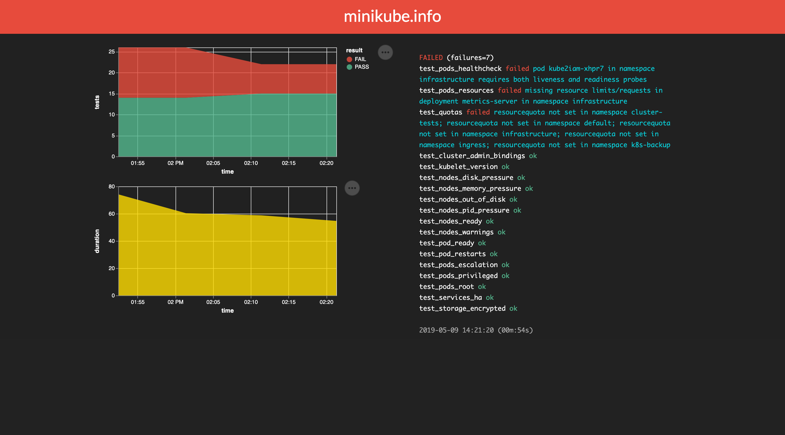

cluster-tests
=============

`cluster-tests` is a test runner intended for in-cluster use.



The available endpoints are:

| Endpoint        | Description      |
| --------------- | ---------------- |
| /               | Show dashboard   |
| /health         | Health endpoint  |
| /api/v1/metrics | Metrics endpoint |

Usage
-----
`cluster-tests` is a single binary that serves as test runner and dashboard/metrics server.

```
Usage: cluster-tests  -d string
        data directory (default "cluster-tests.d")
  -e    output stderr
  -i int
        interval (s) (default 3600)
  -n string
        context name
  -o string
        output directory (default "output")
  -p int
        listen on port (default 8080)
  -r int
        retain (d) (default 2)
  -s string
        server (default "localhost")
```

Dashboard
---------

The default dashboard shows the results of the latest test run on the right and three visualisations on the left. The first chart tracks the number of successful and failed tests over a configurable period of time; the second follows the time taken by these test runs; the last is a histogram of all tests with errors in the period under observation.

Other endpoints
---------------

The server also supports simple metrics for the latest test run (e.g. `{"pass":8,"fail":1,"result":"FAILED"}`) -- and a health check that returns `{"status":"ok"}` on success.

Tests
-----
The tests used here are typically short shell scripts without shebang line. One of the built-in tests is the following:

```shell
for namespace in ${USER_NAMESPACES}; do
  for pod in `kubectl get po --field-selector=status.phase=Running --no-headers -n ${namespace} | cut -d' ' -f1`; do
    result=`kubectl get po/${pod} -n ${namespace} -o json | jq '.spec.containers[] | select(.readinessProbe and .livenessProbe)'`
    if [ "${#result}" -eq 0 ]; then
      echo "pod ${pod} in namespace ${namespace} requires both liveness and readiness probes"
      exit 1
    fi
  done
done
```

A test that exits cleanly will pass, whereas any exit value other than 0 marks a failed test. `${USER_NAMESPACES}` is an example of a configurable environment variable provided to reduce the number of calls to the API server. Testers are free to use `kubectl`, `jq`, `sed` and company or fully formed kubectl queries with `-o jsonpath` selectors. There is no need to redirect `stderr` to `/dev/null` as it is dropped by default (though recoverable for debugging purposes by passing in `-e`).

What happens when a single test reports more than one problem? `exit 1` will not serve in this case. Instead, users can use the built-in function `fail`:

```shell
for namespace in ${USER_NAMESPACES}; do
  resourcequota=`kubectl get resourcequota -n ${namespace} | wc -l`
  if [ "${resourcequota}" -eq "0" ]; then
    fail "resourcequota not set in namespace ${namespace}"
  fi
done
```

`fail` takes exactly one parameter (the desired error string) and can be invoked as many times as necessary in the course of a single test. Error messages are appended, separated by semicolons, and the exit value signals the number of errors found.

Again, users are free to choose either a plain `exit 1` or the more flexible `fail "pod ${pod} in namespace ${namespace} is set to run in privileged security context"`.

Build
-----
The build steps are the following:
```
$ go mod download
$ go get
$ go vet
$ go test -v
$ go build -o cluster-tests .
```

`make build` will run these steps in a two-stage docker build process.

The provided Helm chart simplifies the task of installing (and deleting) the application from your Kubernetes cluster.

